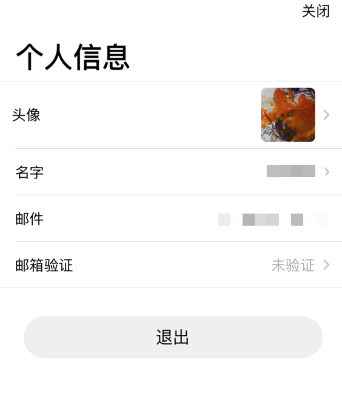

# 注册与登录

> #### 使用邮箱注册时默认没有验证，您可以退出登录后变更邮箱，数据不会丢失。

> #### 您可以定位到我的--&gt;头像，打开个人信息进行邮箱验证，发送验证码填写后完成验证。

> #### 使用AppleID默认验证邮箱，如果您选择了隐藏邮箱登录，以后会放开更换邮箱。

> #### 在其它设备中登录另一台的邮箱账号或使用AppleID登录，会同步账号收藏内容。
>
> 下图示例邮箱验证

