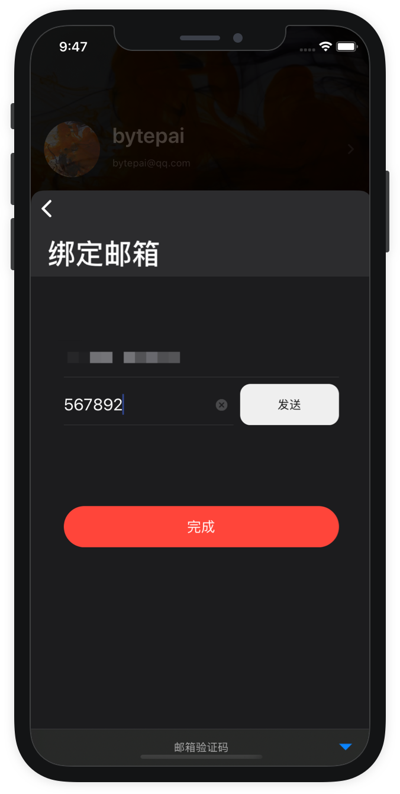

# 注册与登录

> 使用邮箱注册时默认没有验证，您可以退出登录后变更邮箱，数据不会丢失。
>
> 使用Apple ID 选择了隐藏邮箱登录，可以打开【个人信息】重新进行邮箱验证。

> 邮箱验证是为了保证账号安全，在设备丢失或账号遗忘的情况下，以协助我们帮你找回数据。您可以定位到我的--&gt;头像，打开个人信息进行邮箱验证，发送验证码填写后完成验证。

> 在其它设备中登录另一台的邮箱账号或使用AppleID登录，会同步账号收藏内容。

